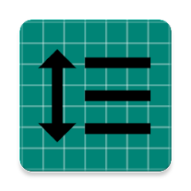

# Gerador de Documentação p/ Laravel

  Adicione o caminho do seu aplicativo que deseja documentar, siga o padrão de comentários desta aplicação e você receberá um JSON com todos os dados necessários para criar sua documentação com a cara que quiser.

  <h2>Padrões de comentários</h2>
  
Para que sua documentação tenha informações relavantes siga o nosso padrão de comentários e nos ajude a identificar descrição da função, detalhes de parâmetro, retorno e etc.

  
  <strong>Modelo de comentário</strong>
  <pre class="text-sm text-muted bg-dark px-2 py-3 rounded-2">
/**
 * @description
 * @route_name
 * @http
 * @tags
 * @return_type
 * @params
 *  {
 *  }
 * @endparams
 * @return
 *  {
 *  }
 * @endreturn
 */</pre>
  
Abaixo veremos cada uma das propriedades explicadas com mais detalhe

  
  <strong>Bloco de comentários</strong>
  
O comentário deve ser exatamente como o exemplo abaixo, iniciando com <em>/**</em> e terminando com <em>*/</em>, sendo logo seguido pela própria função para que possa ser identificado pelo algoritmo e relacionado a função correta.

  <pre class="text-sm text-muted bg-dark px-2 py-3 rounded-2">
/**
 * Comentários aqui
 *
 */
public function name(){}</pre>

  <strong>Descrição da função</strong>
  
Não importa o tamanho que ficará a descrição, não pode quebrar linha para que o algoritmo consiga identificar o inicio e fim

  <pre class="text-sm text-muted bg-dark px-2 py-3 rounded-2" style="white-space: normal;"> * @description Descrição da função sem quebra de linha </pre>
  
  <strong>Nome da Rota</strong>
  
Caso a função seja acessada via requisição http e tiver uma rota que a chama, você pode especificar o nome da rota

  <pre class="text-sm text-muted bg-dark px-2 py-3 rounded-2" style="white-space: normal;"> * @route_name user.store</pre>

  <strong>Método HTTP</strong>
  
Você pode especificar qual é o método http válido para chamar a função

  <pre class="text-sm text-muted bg-dark px-2 py-3 rounded-2" style="white-space: normal;"> * @http [POST,GET,PUT ou DELETE]</pre>

  <strong>Tags</strong>
  
Você pode adicionar tags(separadas por vírgula) para marcar suas funções. 

  <pre class="text-sm text-muted bg-dark px-2 py-3 rounded-2" style="white-space: normal;"> * @tags auth,admin</pre>

  <strong>Tipo de Retorno</strong>
  
Você pode especificar o tipo de retorno da função

  <pre class="text-sm text-muted bg-dark px-2 py-3 rounded-2" style="white-space: normal;"> * @return_type [view/redirect, json, php object, php array, string, boolean, number, void]</pre>

  <strong>Parâmetros</strong>
  

    Esse é o mais trabalhoso. Caso deseje especificar os parâmetros, você deve abrir um bloco iniciando com <em class="text-dark">@params</em> e finalizar com <em class="text-dark">@endparams</em>, e dentro do bloco você passará um objeto JSON(é obrigatório que seja um JSON válido, se não o algoritmo retornará NULL para a definição de parâmetros).
  

  <pre class="text-sm text-muted bg-dark px-2 py-3 rounded-2">
   * @params
   *  {
   *    "request": {
   *      "type": "Request",
   *      "data": {
   *        "code": {
   *          "type": "string",
   *          "description": "CEP"
   *        },
   *        "complement": {
   *          "type": "string",
   *          "description": "Complemento",
   *          "nullable": true
   *        },
   *        "local": {
   *          "type": "string",
   *          "description": "Nome do local (ex. casa, trabalho), válido apenas com is_main = false",
   *          "nullable": true,
   *          "exception": "Obrigatório quando is_main = false"
   *        }
   *      }
   *    }
   *  }
   * @endparams</pre>
  

    No exemplo acima podemos ver algumas das propriedades que podemos usar, e qual é o formato da declaração. 
    O nome do parâmetro é a chave do objeto, e sua descrição é o objeto em si. Vejamos as propriedades válidas:
  

  <ul class="list-group mb-3">
    <li class="list-group-item">
      <b>type: </b>Tipo do parâmetro.
    </li>
    <li class="list-group-item">
      <b>description: </b>Descrição da parâmetro.
    </li>
    <li class="list-group-item">
      <b>nullable = true: </b>Todo parâmetro é obrigatório por padrão, para indicar que ele é opcional deve-se passar a propriedade <em>nullable = true</em>
    </li>
    <li class="list-group-item">
      <b>exception: </b>Caso haja alguma condição para o parâmetro, especifique nessa propriedade.
    </li>
    <li class="list-group-item">
      <b>default: </b>Valor padrão para o campo.
    </li>
    <li class="list-group-item">
      <b>data: </b>Caso queira especificar as propriedades esperadas do parametro(se for um objeto ou array), você pode inserir a propriedade data, e dentro dela inserir os subparâmetros seguindo as regras acima.
    </li>
  </ul>

  <strong>Retorno</strong>
  
Semelhante aos parâmetros, para definir o tipo de retorno devemos abrir um bloco, iniciando com <em class="text-dark">@return</em> e finalizar com <em class="text-dark">@endparams</em>, e dentro passaremos o objeto JSON(é obrigatório que seja um JSON válido, se não o algoritmo retornará NULL para a definição de retorno).

  <pre class="text-sm text-muted bg-dark px-2 py-3 rounded-2">
   * @return 
   *  {
   *    "success": {
   *      "type": "view",
   *      "description": "Retorna a rota route('wallet.index'), com a mensagem de endereço salvo"
   *    },
   *    "error": {
   *      "type": "view",
   *      "description": "Retorna para a tela anterior com a mensagem de erro"
   *    }
   *  }
   * @endreturn
  </pre>
  

    A definição de retorno é um pouco mais simples do que dos parâmetros, com você detalhando apenas as variações de retorno(como no exemplo acima, uma definição para successo e outra para falha), ou você pode passar apenas uma definição com a chave <em class="text-dark">"default"</em> caso só exista um tipo de retorno. 
    Dentro do objeto de definição as propriedades que temos são: 

  

  <ul class="list-group mb-3">
    <li class="list-group-item">
      <b>type: </b>Se retorna uma view, redirecionamento, json, objeto, array, string, etc.
    </li>
    <li class="list-group-item">
      <b>description: </b>Descrição do item retornado
    </li>
   </ul>

